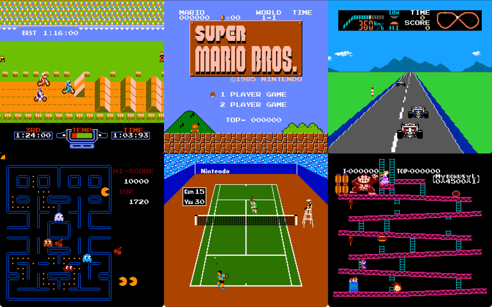

# brightNES

Cycle-accurate NES emulator



## Features

- Instruction Stepped, Cycle Ticked CPU
- Cycle Ticked PPU
- Load external palettes with the `-p` option
- Smooth horizontal scrolling 
- Sprite 0 flag set

## Quick Start

brightNES requires CMake and a C compiler to build

### Compile with system SDL2

Use this option if you have SDL2 already installed

```
git clone https://github.com/neov5/brightNES.git && cd brightNES
mkdir build build/release
cmake -B build/release -DSYSTEM_SDL=1 -DCMAKE_BUILD_TYPE=release
cmake --build build/release
./build/release/brightnes <rom_path> [-p|--palette palette_path]
```

### Compile with packaged SDL2

This install builds SDL2 from source along with the emulator

```
git clone --recurse-submodules https://github.com/neov5/brightNES.git && cd brightNES
mkdir build build/release
cmake -B build/release -DCMAKE_BUILD_TYPE=release
cmake --build build/release
./build/release/brightnes <rom_path> [-p|--palette palette_path]
```

### Debug builds

```
mkdir build build/debug
cmake -B build/debug [-DSYSTEM_SDL=0/1] -DCMAKE_BUILD_TYPE=debug && cmake --build build/debug
./build/debug/brightnes <rom_path> [-p|--palette palette_path]
```

Note that the debugger stalls at start, and the window can be a bit 
unresponsive as a result of not processing SDL events.

## Debug Mode

BrightNES supports rudimentary command-line based debugging when compiled 
with NES_DEBUG defined (set in debug builds). Debug mode breaks on entry and 
gives you a prompt to step through the program

```
(cpu:       7) (ppu:      25) DEBUG [PPU r:000 c:025 ctrl:00 mask:00 status:00 v:0000 t:0000 x:0 w:0]
(cpu:       7) (ppu:      25) DEBUG [CPU A:00 X:00 Y:00 PC:8000 S:fd P:34]
>
```

You can either:
- Step to the first cpu cycle >= X, using `s X`
- Exit debug mode using `e`
- Step to the next instruction and printing the CPU/PPU status by hitting enter

In addition, the logs are written to `brightnes.log` in `build/debug`.

## TODO

- [ ] Debug remaining mapper 0 games
  - [ ] Ice Climber 
  - [ ] Ice Hockey
  - [ ] SMB rendering when mario is at the top of the screen
- [ ] APU
- [ ] Mappers
  - [ ] MMC1
  - [ ] MMC3
  - [ ] MMC5
- [ ] Full-featured debug mode?
